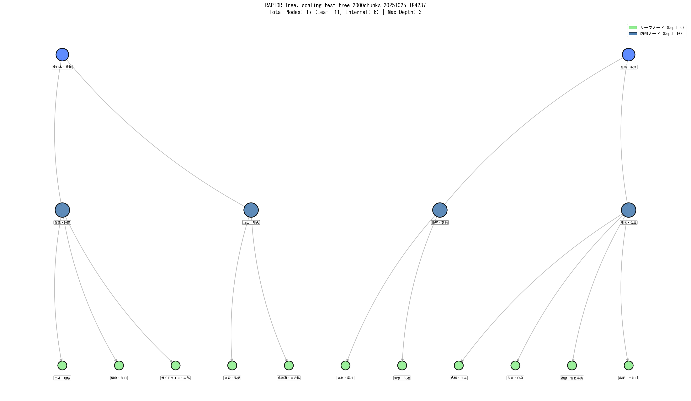

# GitHub リポジトリ登録手順

このガイドでは、`multimodal-raptor-colvbert-blip`プロジェクトをGitHubに登録する手順を説明します。

## 📋 事前準備

### 1. コミット対象ファイルの確認

**コミットするファイル:**
```
✅ README.md                              # プロジェクト説明
✅ requirements.txt                       # 依存パッケージ
✅ Pipfile                                # Pipenv設定
✅ visual_raptor_colbert.py               # メイン実装
✅ scaling_test_raptor.py                 # スケーリングテスト
✅ visualize_raptor_tree.py               # Tree可視化
✅ build_ColVBERT_BLIP_tree_46pdfs.py     # Tree構築スクリプト
✅ build_raptor_tree2K_ColVBERT_BLIP.py   # 2000チャンク専用スクリプト
✅ Multimodal_Practice.md                 # Phase実装記録
✅ .gitignore                             # Git除外設定

✅ 0_base_tsunami-lesson-rag/
   ├── raptor_eval.py
   └── tsunami_lesson_raptor.py

✅ data/encoder_comparison_46pdfs/raptor_trees/
   ├── scaling_test_tree_2000chunks_*_tree.png     # 可視化画像（365KB）
   ├── scaling_test_tree_2000chunks_*_stats.png
   ├── scaling_test_tree_1000chunks_*_tree.png
   ├── scaling_test_tree_1000chunks_*_stats.png
   ├── scaling_test_tree_500chunks_*_tree.png
   ├── scaling_test_tree_500chunks_*_stats.png
   ├── scaling_test_tree_250chunks_*_tree.png
   └── scaling_test_tree_250chunks_*_stats.png
```

**除外するファイル（.gitignoreで設定済み）:**
```
❌ *.pkl                                  # Treeファイル（数十MB〜数百MB）
❌ data/disaster_visual_documents/*.pdf   # 元PDF（数GB）
❌ data/encoder_comparison_46pdfs/images/*.png  # ページ画像（数GB）
❌ data/encoder_comparison_46pdfs/pdf_text_cache.json  # テキストキャッシュ（数MB）
❌ data/encoder_comparison_46pdfs/results/*.txt  # ログファイル（数MB）
❌ __pycache__/                           # Pythonキャッシュ
```

### 2. .gitignoreの確認

`.gitignore`が正しく設定されているか確認:

```bash
cat .gitignore
```

大容量ファイル（PKL、PDF、PNG画像、JSON キャッシュ）が除外設定されていることを確認してください。

## 🚀 GitHub登録手順

### ステップ1: Gitリポジトリ初期化

```bash
cd c:\Users\yasun\LangChain\learning-langchain\multimodal-raptor-colvbert-blip

# Gitリポジトリ初期化
git init

# 現在のブランチをmainに変更（推奨）
git branch -M main
```

### ステップ2: ファイルをステージング

```bash
# .gitignoreを最初にコミット
git add .gitignore
git commit -m "Add .gitignore to exclude large files"

# 全てのファイルを追加（.gitignoreで除外設定済み）
git add .

# ステージングされたファイルを確認
git status
```

**確認ポイント:**
- PKLファイルが含まれていないこと
- PNG画像はraptor_treesディレクトリ内のみ（可視化結果）
- PDFファイルが含まれていないこと

### ステップ3: 初回コミット

```bash
git commit -m "Initial commit: ColVBERT RAPTOR for disaster documents

Features:
- 2000-chunk RAPTOR tree construction (72.4 min)
- TF-IDF keyword extraction for tree visualization
- GPU-accelerated multimodal embeddings
- GPT-OSS-20b for high-quality summaries
- Scaling test results (250/500/1000/2000 chunks)
- NetworkX tree visualization with keyword labels

Results:
- Tree nodes: 17 (11 leaf, 6 internal)
- Max depth: 3
- Avg Silhouette: 0.153
- GPU usage: 15.4 GB / 16.0 GB
"
```

### ステップ4: GitHubリポジトリ作成

1. **GitHubにアクセス**: https://github.com
2. **新規リポジトリ作成**: 右上の「+」→「New repository」
3. **リポジトリ設定**:
   - Repository name: `multimodal-raptor-colvbert-blip`
   - Description: `ColVBERT (BLIP) based Multimodal RAPTOR for Disaster Document Analysis - 46 PDFs, 2378 pages, GPU-optimized`
   - Visibility: `Public` または `Private`
   - **README.mdは追加しない**（既にローカルにあるため）
   - **Add .gitignoreは選択しない**（既にローカルにあるため）

4. **「Create repository」をクリック**

### ステップ5: リモートリポジトリと接続

GitHubリポジトリ作成後に表示される手順を実行:

```bash
# リモートリポジトリを追加
git remote add origin https://github.com/YOUR_USERNAME/multimodal-raptor-colvbert-blip.git

# または SSH を使用する場合:
# git remote add origin git@github.com:YOUR_USERNAME/multimodal-raptor-colvbert-blip.git

# リモートリポジトリ確認
git remote -v
```

### ステップ6: プッシュ

```bash
# mainブランチにプッシュ
git push -u origin main
```

**認証方法:**
- **HTTPS**: GitHubのユーザー名とPersonal Access Token（PAT）を使用
- **SSH**: SSH鍵を事前にGitHubに登録

## 📝 リポジトリ説明文（About）の設定

GitHubリポジトリページで「About」の歯車アイコンをクリックして設定:

**Description:**
```
ColVBERT (BLIP) based Multimodal RAPTOR for Disaster Document Analysis - GPU-optimized hierarchical retrieval system for 46 PDFs (2378 pages) of tsunami lessons
```

**Topics (tags):**
```
raptor, colbert, blip, multimodal-rag, gpu-acceleration, disaster-analysis, hierarchical-clustering, tfidf, networkx, pytorch
```

**Website:**
```
（オプション: プロジェクトウェブサイトがあれば）
```

## 🏷️ タグ（Release）の作成（オプション）

プロジェクトの主要なマイルストーンでタグを作成:

```bash
# v1.0タグ作成
git tag -a v1.0 -m "Release v1.0: 2000-chunk RAPTOR tree with visualization

- ColVBERT (BLIP) encoder
- GPT-OSS-20b for summaries
- TF-IDF keyword extraction
- NetworkX tree visualization
- Scaling test results (250/500/1000/2000 chunks)
"

# タグをプッシュ
git push origin v1.0
```

## 📊 リポジトリ構成の確認

プッシュ後、GitHubリポジトリで以下を確認:

1. **README.md**: プロジェクト概要が正しく表示されているか
2. **可視化画像**: README内の画像リンクが機能しているか
3. **ファイルサイズ**: 大容量ファイルが除外されているか（合計サイズが数十MB以下）
4. **ライセンス**: 必要に応じてLICENSEファイルを追加

## 🔧 トラブルシューティング

### 画像が表示されない

README.md内の画像パスを相対パスで記述:

```markdown

```

### 大容量ファイルがコミットされてしまった

```bash
# 最後のコミットを取り消し
git reset --soft HEAD~1

# .gitignoreを修正して再度コミット
git add .gitignore
git commit -m "Fix .gitignore"

# 再度ファイルを追加
git add .
git commit -m "Initial commit (fixed)"
```

### プッシュサイズが大きすぎる

GitHub の推奨リポジトリサイズは1GB以下です。大容量ファイルを確認:

```bash
# ファイルサイズを確認
git ls-files -s | awk '{print $4, $2}' | sort -n -r | head -20
```

## 📚 次のステップ

1. **README.md更新**: 定期的に実行結果を更新
2. **Issues作成**: 今後の改善点をIssuesとして管理
3. **Projects設定**: タスク管理にGitHub Projectsを活用
4. **GitHub Pages**: （オプション）ドキュメントサイトを公開
5. **CI/CD**: （オプション）GitHub Actionsで自動テスト

## ✅ チェックリスト

- [ ] `.gitignore`作成・確認
- [ ] Gitリポジトリ初期化
- [ ] ファイルをステージング・コミット
- [ ] GitHubリポジトリ作成
- [ ] リモートリポジトリ接続
- [ ] プッシュ実行
- [ ] README.md表示確認
- [ ] 画像リンク確認
- [ ] リポジトリサイズ確認（推奨: <100MB）
- [ ] Description・Topics設定

---

**作成日**: 2025年10月25日
**対象プロジェクト**: multimodal-raptor-colvbert-blip
