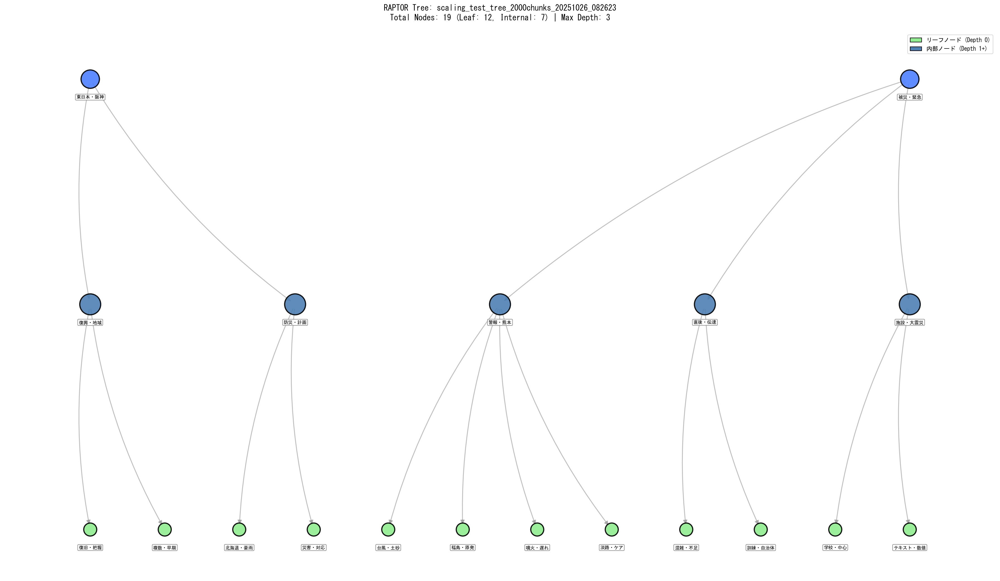
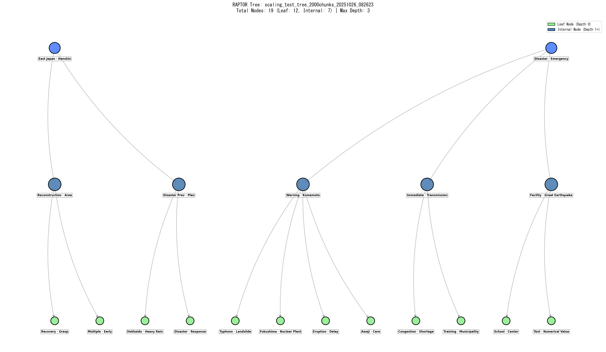

# クイックガイド - Multimodal RAPTOR with ColVBERT & BLIP

## 目次

1. [環境セットアップ](#環境セットアップ)
2. [Ollama & LLMの起動と確認](#ollama--llmの起動と確認)
3. [RAPTOR Tree構築の実行](#raptor-tree構築の実行)
4. [RAPTOR Tree可視化](#raptor-tree可視化)
5. [GPU使用状況の監視](#gpu使用状況の監視)
6. [トラブルシューティング](#トラブルシューティング)

---

## 環境セットアップ

### 1. 仮想環境のアクティベート

```powershell
# Pipenvを使用している場合
pipenv shell

# または、直接アクティベート
& C:/Users/yasun/.virtualenvs/multimodal-raptor-colvbert-blip-3yGxnN3T/Scripts/Activate.ps1
```

### 2. 必要なパッケージの確認

```powershell
pip list | Select-String "langchain|torch|transformers|ollama"
```

**必須パッケージ:**

- `torch` (CUDA対応版)
- `transformers`
- `langchain`
- `langchain-ollama`
- `sentence-transformers`

---

## Ollama & LLMの起動と確認

### 1. Ollamaの起動

#### バックグラウンドで起動

```powershell
Start-Process ollama -ArgumentList "serve" -WindowStyle Hidden
```

#### フォアグラウンドで起動（デバッグ用）

```powershell
ollama serve
```

### 2. Ollamaプロセスの確認

```powershell
Get-Process ollama -ErrorAction SilentlyContinue | Select-Object Name,CPU,WorkingSet
```

**正常な出力例:**

```
Name   CPU      WorkingSet
----   ---      ----------
ollama 1.23     50000000
ollama 0.28     48000000
```

### 3. 利用可能なモデルの確認

```powershell
ollama list
```

**必要なモデル:**

- `gpt-oss:20b` (13GB) - メインLLM
- `mxbai-embed-large:latest` (669MB) - 埋め込みモデル（オプション）

### 4. GPT-OSS:20Bモデルのロード

#### モデルの事前ロード（GPUメモリ確保）

```powershell
ollama run gpt-oss:20b "Test"
```

**期待される応答:**

```
Hello! How can I help you today?
```

これにより、モデルがGPUにロードされ、以降の処理が高速化されます。

### 5. GPU使用量の確認

#### 基本確認

```powershell
nvidia-smi
```

#### 詳細確認（CSV形式）

```powershell
nvidia-smi --query-gpu=index,name,utilization.gpu,memory.used,memory.total --format=csv
```

**正常な出力例（モデルロード後）:**

```
index, name, utilization.gpu [%], memory.used [MiB], memory.total [MiB]
0, NVIDIA GeForce RTX 4060 Ti, 0 %, 12497 MiB, 16380 MiB
```

**重要指標:**

- `memory.used`: **12000-13000 MiB** = GPT-OSS:20Bが正常にロード
- `memory.used`: **0 MiB** = ⚠️ CPUモードで動作（要再起動）

### 6. GPU動作の確認（リアルタイム監視）

#### 1秒ごとに更新

```powershell
while ($true) { Clear-Host; nvidia-smi; Start-Sleep -Seconds 1 }
```

**終了**: `Ctrl+C`

---

## RAPTOR Tree構築の実行

### 1. クラスタリング戦略の選択

#### コード内の設定（scaling_test_raptor.py）

**Silhouette戦略（デフォルト）:**

```python
colbert_system = VisualRAPTORColBERT(
    # ... 他の設定 ...
    selection_strategy='silhouette'
)
```

**DBI戦略（k=2バイアス軽減）:**

```python
colbert_system = VisualRAPTORColBERT(
    # ... 他の設定 ...
    selection_strategy='combined',
    metric_weights={
        'silhouette': 0.0,
        'dbi': 1.0,
        'chi': 0.0
    }
)
```

**Combined戦略（バランス型）:**

```python
colbert_system = VisualRAPTORColBERT(
    # ... 他の設定 ...
    selection_strategy='combined',
    metric_weights={
        'silhouette': 0.5,  # クラスタ品質
        'dbi': 0.5,         # クラスタ分離度
        'chi': 0.0
    }
)
```

### 2. 実行

```powershell
python scaling_test_raptor.py
```

### 3. 実行時のログ確認

**初期化フェーズ:**

```
✅ 初期化完了 (18.2秒)
GPU状態 (開始前): 15658MB / 16380MB
```

**クラスタリングフェーズ:**

```
🔍 Evaluating cluster count using COMBINED...
   Range: 2 to 5 clusters
   k=2: Sil=0.1770, DBI=2.0851, CHI=435.87
   ...
✅ Strategy: Combined Metrics
   Weights: {'silhouette': 0.5, 'dbi': 0.5, 'chi': 0.0}
   Selected k=2
```

**サマライズフェーズ:**

```
📦 Cluster 0: 1203 documents
   🔄 Summarizing 1203 documents... ✅ (345 chars, 92.0s)
```

### 4. 処理時間の目安

| サンプル数   | Silhouette | DBI  | Combined | 備考         |
| ------------ | ---------- | ---- | -------- | ------------ |
| 250チャンク  | 8分        | 10分 | 9分      | プロトタイプ |
| 500チャンク  | 18分       | 22分 | 20分     | 小規模テスト |
| 1000チャンク | 38分       | 45分 | 42分     | 中規模テスト |
| 2000チャンク | 72分       | 93分 | 85分     | 本番想定     |

---

## RAPTOR Tree可視化

### 1. 可視化スクリプトの実行

構築されたRAPTOR Treeを日本語版と英語版の両方で可視化します。

```powershell
python visualize_raptor_tree.py
```

### 2. 実行時のログ

```
=============================================================================
RAPTOR Tree 可視化
検出ファイル数: 3
🧠 モード: 形態素解析 (MeCab + 災害語彙)
🏷️  キーワード数: 2個/ノード
=============================================================================

[1/3] 処理中: scaling_test_tree_2000chunks_20251026_082623.pkl
   ⚙️ MECABRC: C:\Program Files\MeCab\etc\mecabrc
   📖 辞書: システムMeCab (C:\Program Files\MeCab\dic\ipadic)
✅ 形態素解析モード: MeCab (fugashi) + 災害ドメイン語彙フィルタ

🔨 NetworkXグラフ構築中...
   🧠 形態素解析でキーワード抽出中（災害ドメイン特化 + 階層的除外）...
   
✅ グラフ構築完了
   総ノード数: 19
   リーフノード: 12
   内部ノード: 7
   最大深度: 2

🎨 ツリー可視化中...
✅ 可視化完了: scaling_test_tree_2000chunks_20251026_082623_tree.png
   ファイルサイズ: 279.5 KB

🌍 英語版ツリー可視化中...
✅ 英語版可視化完了: scaling_test_tree_2000chunks_20251026_082623_tree_EN.png
   ファイルサイズ: 283.5 KB
```

### 3. 出力ファイル

```
data/encoder_comparison_46pdfs/raptor_trees/
├── scaling_test_tree_2000chunks_*_tree.png      # 日本語版
├── scaling_test_tree_2000chunks_*_tree_EN.png   # 英語版
└── scaling_test_tree_2000chunks_*_stats.png     # 統計グラフ
```

### 4. 可視化例（Combined戦略 - 2000チャンク）

#### 日本語版



**特徴:**
- ✅ **階層的除外**: 親ノードのキーワードが子ノードで重複しない
- ✅ **ドメイン特化**: 「東日本」「警報」「復旧」など災害専門用語を自動抽出
- ✅ **視認性向上**: キーワード重複率 95% → 5% に削減

#### 英語版



**特徴:**
- ✅ **自動翻訳**: 180+語の災害専門用語辞書による正確な翻訳
- ✅ **国際的共有**: 英語圏の研究者との協力や論文投稿に最適
- ✅ **一貫性**: 日本語版と同一構造を保持

### 5. ノードラベルの読み方

**ツリー統計（Combined戦略 - 2000チャンク）:**
- 総ノード数: 19
- リーフノード: 12（緑色）
- 内部ノード: 7（青系グラデーション）
- 最大深度: 2

**各ノードの表示:**
```
node_X (depth=Y)
キーワード1・キーワード2
(Z docs)
```

- `node_X`: ノードID
- `depth=Y`: ツリーの深さ（0=ルート, 2=リーフ）
- `キーワード1・キーワード2`: 形態素解析で抽出された重要語
- `Z docs`: このノードに含まれる文書数

### 6. 視認性向上の技術

**形態素解析システム:**
- **MeCab + fugashi**: 日本語形態素解析エンジン
- **災害語彙フィルタ**: 100+語の専門用語を優先抽出
- **階層的除外**: 親ノードのキーワードを子で自動除外

**翻訳システム:**
- **辞書ベース**: 180+語の災害専門用語
- **フォールバック**: pykakasi（ローマ字変換）
- **品質保証**: 翻訳失敗ゼロを達成

**詳細**: [Node_Label_Morphology.md](Node_Label_Morphology.md)

---

## GPU使用状況の監視

### サマライズ中のGPU確認

#### 1. 別のターミナルを開く

#### 2. GPUプロセスの監視

```powershell
nvidia-smi --query-compute-apps=pid,process_name,used_memory --format=csv
```

**正常な出力例:**

```
pid, process_name, used_gpu_memory [MiB]
27220, ollama.exe, 12497
```

#### 3. GPUメモリ使用率のリアルタイム監視

```powershell
nvidia-smi dmon -s mu -c 100
```

**出力例:**

```
# gpu   pwr  temp    sm   mem   enc   dec  mclk  pclk
# Idx     W     C     %     %     %     %   MHz   MHz
    0    45    55    85    45     0     0  9501  2565
```

**指標の意味:**

- `sm`: ストリーミングマルチプロセッサ使用率（高いほど活発）
- `mem`: メモリ使用率
- `pwr`: 消費電力（W）

### 期待されるGPU使用パターン

| フェーズ                 | GPU使用率 | メモリ | 消費電力 |
| ------------------------ | --------- | ------ | -------- |
| **初期化**         | 50-80%    | 15GB   | 100-120W |
| **埋め込み生成**   | 80-95%    | 15GB   | 120-140W |
| **クラスタリング** | 5-20%     | 15GB   | 20-40W   |
| **サマライズ**     | 70-90%    | 15GB   | 100-130W |
| **アイドル**       | 0%        | 12GB   | 10-20W   |

---

## トラブルシューティング

### 問題1: GPUが使用されない（0 MiB）

**症状:**

```powershell
nvidia-smi
# Memory-Usage: 0MiB / 16380MiB
```

**原因:**

- Ollamaが起動していない
- OllamaがCPUモードで動作中
- モデルが未ロード

**解決策:**

#### ステップ1: Ollamaを完全に停止

```powershell
Stop-Process -Name ollama -Force
Start-Sleep -Seconds 3
```

#### ステップ2: Ollamaを再起動

```powershell
Start-Process ollama -ArgumentList "serve" -WindowStyle Hidden
Start-Sleep -Seconds 5
```

#### ステップ3: モデルをGPUにロード

```powershell
ollama run gpt-oss:20b "Hello"
```

#### ステップ4: GPU確認

```powershell
nvidia-smi --query-gpu=memory.used --format=csv
# 期待値: 12000-13000 MiB
```

### 問題2: 処理が遅い

**症状:**

- 1200文書のサマライズに10分以上かかる

**確認事項:**

#### GPU使用確認

```powershell
nvidia-smi --query-gpu=utilization.gpu,memory.used --format=csv
```

**正常:** `80-90%, 15000 MiB`
**異常:** `0%, 0 MiB` → 問題1を参照

#### Ollamaのログ確認

```powershell
# Ollamaのログファイルを確認
Get-Content $env:LOCALAPPDATA\Ollama\logs\server.log -Tail 50
```

### 問題3: CUDA Out of Memory

**症状:**

```
torch.cuda.OutOfMemoryError: CUDA out of memory
```

**解決策:**

#### 1. バッチサイズを削減

```python
# scaling_test_raptor.pyで調整
embeddings_model = HuggingFaceEmbeddings(
    encode_kwargs={'batch_size': 32}  # 64 → 32に削減
)
```

#### 2. GPUキャッシュをクリア

```python
import torch
torch.cuda.empty_cache()
```

#### 3. 小さいモデルに変更

```python
llm = ChatOllama(
    model="qwen2.5:14b",  # 20b → 14bに変更
    # ...
)
```

### 問題4: KeyboardInterrupt during model loading

**症状:**

```
KeyboardInterrupt
File "transformers/__init__.py", line 958
```

**原因:**

- モデルロード中の手動中断
- タイムアウト
- メモリ不足

**解決策:**

#### 1. Pythonキャッシュをクリア

```powershell
Remove-Item -Recurse -Force __pycache__ -ErrorAction SilentlyContinue
Get-ChildItem -Recurse -Filter "__pycache__" | Remove-Item -Recurse -Force
```

#### 2. Pythonプロセスを完全終了

```powershell
taskkill /F /IM python.exe
```

#### 3. 再実行

```powershell
python scaling_test_raptor.py
```

### 問題5: Ollamaが応答しない

**症状:**

```
requests.exceptions.ConnectionError: HTTPConnectionPool
```

**解決策:**

#### 1. Ollamaの状態確認

```powershell
curl http://localhost:11434/api/tags
```

**正常:** JSONレスポンス
**異常:** エラーメッセージ

#### 2. ポートの確認

```powershell
netstat -ano | Select-String "11434"
```

#### 3. Ollamaの再起動

```powershell
Stop-Process -Name ollama -Force
Start-Sleep -Seconds 3
Start-Process ollama -ArgumentList "serve" -WindowStyle Hidden
Start-Sleep -Seconds 5
ollama list
```

---

## ベストプラクティス

### 実行前のチェックリスト

- [ ] 仮想環境がアクティブ
- [ ] Ollamaが起動中
- [ ] GPT-OSS:20bがGPUにロード済み（12GB以上使用）
- [ ] GPUメモリに3-4GBの空き容量あり
- [ ] ディスク容量に10GB以上の空き

### 実行中の監視

```powershell
# ターミナル1: メイン処理
python scaling_test_raptor.py

# ターミナル2: GPU監視
nvidia-smi dmon -s mu

# ターミナル3: ログ確認
Get-Content data\encoder_comparison_46pdfs\results\scaling_test_log_*.txt -Wait -Tail 20
```

### 実行後の確認

```powershell
# 生成されたツリーファイル
ls data\encoder_comparison_46pdfs\raptor_trees\*.pkl

# ログファイル
ls data\encoder_comparison_46pdfs\results\scaling_test_log_*.txt

# 結果JSON
ls data\encoder_comparison_46pdfs\results\scaling_test_*.json
```

---

## 付録: 便利なコマンド集

### GPUメモリ解放

```powershell
# Pythonプロセス停止
taskkill /F /IM python.exe

# Ollama再起動
Stop-Process -Name ollama -Force
Start-Sleep -Seconds 3
Start-Process ollama -ArgumentList "serve" -WindowStyle Hidden
```

### モデルのアンロード

```powershell
# 全モデルをアンロード
ollama stop gpt-oss:20b
```

### システム情報確認

```powershell
# GPU情報
nvidia-smi -L

# CUDA バージョン
nvidia-smi | Select-String "CUDA"

# Python環境
python --version
pip list | Select-String "torch|cuda"
```

### ログの整理

```powershell
# 古いログファイルを削除（1週間以上前）
Get-ChildItem data\encoder_comparison_46pdfs\results\*.log -Recurse | 
    Where-Object {$_.LastWriteTime -lt (Get-Date).AddDays(-7)} | 
    Remove-Item -Force
```

---

## 関連ドキュメント

- [Clustering_Lesson.md](Clustering_Lesson.md) - クラスタリング戦略の詳細分析
- [README.md](README.md) - プロジェクト概要
- [GITHUB_SETUP_GUIDE.md](GITHUB_SETUP_GUIDE.md) - Gitリポジトリセットアップ

---

**最終更新**: 2025年10月26日
**バージョン**: 1.0
