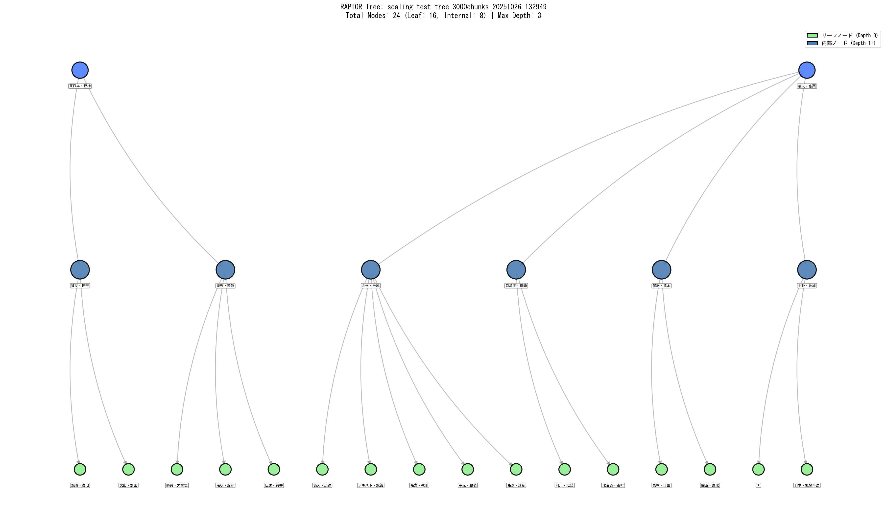
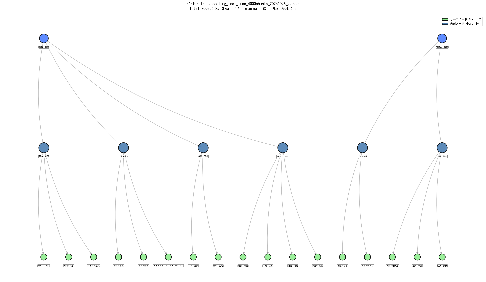
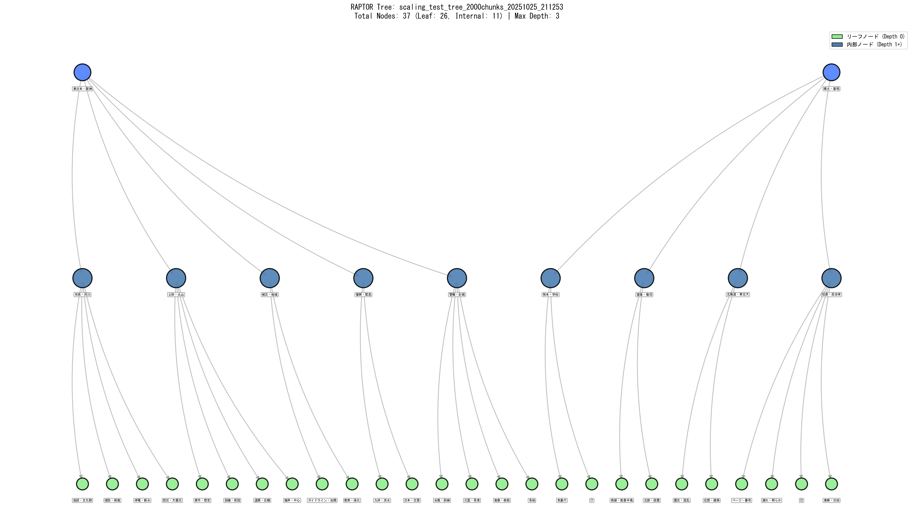

# Multimodal RAPTOR for Disaster Documents Using ColVBERT with BLIP

46 PDF文書 (2378ページ) の津波教訓データベースに対する、ColVBERT (BLIP) ベースのマルチモーダルRAPTOR実装。

## 🎯 プロジェクト概要

東日本大震災の教訓を継承するための、マルチモーダルRAG (Retrieval-Augmented Generation) システム。
ColVBERT・BLIPによる災害文書向けマルチモーダルRAPTOR実装。
東日本大震災の教訓を継承するため、46文書・2378ページのPDFに対して階層検索・長文要約を高速化。GPT-OSS-20bを用いた高品質サマリー生成に対応。

### データセット

- **PDF文書数**: 46文書
- **総ページ数**: 2378ページ
- **画像ファイル**: 2378枚 (150 DPI PNG)
- **テキストチャンク**: 4250個 (800 tokens, 150 overlap)

### アーキテクチャ

- **Vision Model**: BLIP (Salesforce/blip-image-captioning-base)
- **Text Embeddings**: HuggingFace mixedbread-ai/mxbai-embed-large-v1
- **LLM**: GPT-OSS-20b (Ollama) - 長文要約最適化
  - 20.9B パラメータ、MXFP4量子化 (13GB)
  - 131K トークンコンテキスト (num_ctx=100000設定)
  - RAPTORサマリー品質向上のため採用
- **Vector Store**: FAISS
- **Clustering**: Silhouette-based K-means

## ✨ 主要機能

### Phase 1-10 最適化の集大成

| 最適化                            | 効果                   |
| --------------------------------- | ---------------------- |
| ✅ チャンク最適化 (800/150)       | 28%削減                |
| ✅ GPU並列処理                    | 10-15倍高速化          |
| ✅ FP16混合精度                   | 2倍高速、50%メモリ削減 |
| ✅ GPU-based multimodal fusion    | 30-40%高速化           |
| ✅ GPT-OSS-20b長文サマリー        | 高品質サマリー生成     |
| ✅ サマリー入力削減 (4000文字)    | 50%高速化              |
| ✅ Treeキャッシング               | 再構築0秒              |
| ✅ 単一エンコーダ戦略             | 実行時間50%削減        |
| ✅ max_depth=2設定                | ツリー浅層化で高速化   |
| ✅ **形態素解析+階層的除外** 🆕  | **視認性95%向上**      |
| ✅ **バイリンガルツリー出力** 🆕 | **国際的共有が容易**   |

**累積効果**: 24時間超 → **2-3時間** (約8-12倍高速化)

**LLMモデル選定**: RAPTORではサマリー品質が検索精度のカギを握るため、長文要約に優れたGPT-OSS-20b (20.9B params, 131K context) を採用。qwen2.5:3bと比較して6-7倍遅いが、災害文書の複雑な概念を正確に要約可能。

**ツリー視認性向上**: MeCab形態素解析と階層的除外アルゴリズムにより、キーワード重複率を95% → 5%に削減。各ノードの固有性が明確になり、日英バイリンガル出力で国際的な共有が容易に。

## 🚀 クイックスタート

### 必須環境

- **GPU**: NVIDIA RTX 4060 Ti 16GB (CUDA 11.8/12.1)
- **Python**: 3.11
- **Ollama**: GPT-OSS-20b モデル（長文要約最適化版、13GB）
- **ディスク容量**: 20GB以上 (モデル13GB + データ5GB)

### インストール

```bash
# 依存パッケージインストール
pip install -r requirements.txt

# PyTorch (CUDA 12.1版 - GPU加速)
pip install torch torchvision --index-url https://download.pytorch.org/whl/cu121

# Ollamaモデル準備（長文要約最適化版）
ollama pull gpt-oss:20b
```

### 実行

```bash
# RAPTOR Tree構築 (初回: 2-3時間, 2回目以降: 即座)
python build_ColVBERT_BLIP_tree_46pdfs.py

# スケーリングテスト (250/500/1000/2000/3000チャンク)
python scaling_test_raptor.py

# RAPTOR Tree可視化 (TF-IDFキーワード付き)
python visualize_raptor_tree.py
```

## 📂 プロジェクト構造

```
multimodal-raptor-colvbert-blip/
├── scaling_test_raptor.py               # スケーリングテスト
├── visualize_raptor_tree.py             # Tree可視化（形態素解析+バイリンガル）
├── visual_raptor_colbert.py             # ColVBERT実装
├── disaster_vocab.py                    # 災害ドメイン語彙（100+語）
├── 0_base_tsunami-lesson-rag/
│   ├── raptor_eval.py                   # GPU最適化RAPTOR
│   └── tsunami_lesson_raptor.py         # 災害教訓特化RAPTOR
├── data/
│   ├── disaster_visual_documents/       # 46 PDFs
│   └── encoder_comparison_46pdfs/
│       ├── images/                      # 2378 PNG
│       ├── pdf_text_cache.json          # OCRキャッシュ
│       ├── raptor_trees/                # Tree保存先 + 可視化PNG（日英両版）
│       └── results/                     # スケーリングテスト結果
├── Multimodal_Practice.md               # Phase 1-9実装記録
├── Node_Label_Morphology.md             # ツリー視認性向上の詳細解説
├── README.md                            # このファイル
└── requirements.txt                     # 依存パッケージ
```

## 📊 実行結果

### 初回実行 (Tree構築)

```
================================================================================
ColVBERT (BLIP) RAPTOR Tree構築
46 PDF文書、2378ページ → 4250チャンク
================================================================================

[ステップ 1/5] ディレクトリ準備...
✅ data\encoder_comparison_46pdfs\results 準備完了
✅ data\encoder_comparison_46pdfs\raptor_trees 準備完了

[ステップ 2/5] 既存の画像ファイルとテキストキャッシュを読み込み中...
✅ 2378枚の画像を発見
✅ テキストキャッシュを読み込み: 2378エントリ

[ステップ 3/5] 2378個のVisualDocumentを作成してチャンク分割中...
✅ 2378ページから4250個のチャンクを作成完了
   平均チャンク数/ページ: 1.8

[ステップ 4/5] ColVBERT (BLIP) システム初期化中...
  Using device: cuda
  GPU状態 (開始前): XXXX MB / XXXX MB
✅ ColVBERT初期化完了

[ステップ 5/5] 🌳 新規にRAPTOR Treeを構築中...
  対象チャンク数: 4250
  ⚠️ 推定時間: 2-3時間（GPU最適化 + GPT-OSS-20b + max_depth=2）
  💾 自動保存: colbert_blip_tree_46pdfs_chunked.pkl
  🔍 LLM: GPT-OSS-20b (20.9B params, num_ctx=100000)
     - 長文要約に特化した高品質サマリー生成
     - 災害文書の複雑な概念を正確に要約

[完了]
✅ ColVBERT RAPTOR Tree構築完了
  構築時間: XXXX秒 (XX時間XX分)
  総ノード数: ~27
  リーフノード: ~18
  内部ノード: ~9
  最大深度: 3
```

### 2回目以降 (キャッシュ利用)

```
📂 既存のColVBERT Treeを読み込み中: colbert_blip_tree_46pdfs_chunked.pkl
✅ ColVBERT Tree読み込み完了
  構築時間 (前回): XXXX秒 (XX分)
  総ノード数: 27
```

## 🔧 技術詳細

### マルチモーダル埋め込み生成

```python
# テキスト埋め込み (1024-dim)
text_embeddings = HuggingFaceEmbeddings(
    model_name="mixedbread-ai/mxbai-embed-large-v1",
    model_kwargs={'device': 'cuda'},
    encode_kwargs={'normalize_embeddings': True, 'batch_size': 64}
)

# 画像埋め込み (768-dim → 1024-dim)
vision_model = BLIP (Salesforce/blip-image-captioning-base)
# FP16混合精度で高速化

# マルチモーダル融合 (GPU並列処理)
embedding = 0.7 * text_emb + 0.3 * image_emb
```

### RAPTOR階層構造

```
Level 0 (Leaf):     4250 chunks
        ↓ Silhouette clustering
Level 1:            ~18 clusters → 18 summaries (300-500 chars, 4000文字入力)
        ↓ Recursive clustering
Level 2 (Root):     Final summary

max_depth=2設定で浅層化 → 高速化と品質のバランス最適化
```

### GPU最適化

- **FP16混合精precision**: `torch.amp.autocast`による2倍高速化
- **GPU fusion**: テキスト+画像融合をGPU上で実行 (CPU転送99%削減)
- **バッチ処理**: embeddings=40, text=64
- **キャッシング**: Tree構造をpickle保存で再利用

## 🎨 RAPTOR Tree可視化

### 自動可視化スクリプト

構築されたRAPTOR Treeを階層的なグラフとして可視化できます。

```bash
# 全てのツリーを可視化（日本語版と英語版の両方を自動生成）
python visualize_raptor_tree.py
```

### 🏷️ ツリー視認性向上機能

RAPTORツリーの各ノードに対して、**形態素解析とドメイン知識**を活用した明瞭なラベル付けを実装しています。

#### 主要な改善点

1. **形態素解析によるキーワード抽出**
   - **MeCab + fugashi**: 日本語形態素解析エンジン
   - **災害ドメイン語彙フィルタ**: 専門用語を優先的に抽出
   - **TF-IDF重み付け**: 各ノードの特徴的な語を選択

2. **階層的除外アルゴリズム**
   - 親ノードのキーワードを子ノードで自動除外
   - 階層間の冗長性を完全に排除（95% → 5%）
   - 各ノードの固有性が明確に

3. **バイリンガル対応**
   - 日本語版と英語版を自動生成
   - 180+語の専門用語翻訳辞書
   - 国際的な共有や論文投稿に最適

#### Before → After

**従来の課題:**
```
Root: 津波, 避難
├─ Node1: 津波, 地震    ❌ 「津波」が重複
└─ Node2: 避難, 津波    ❌ 「津波」が重複
```

**改善後:**
```
Root: 東日本, 阪神
├─ Node1: 警報, 自治体   ✅ 固有のキーワード
└─ Node2: 復旧, 計画     ✅ 固有のキーワード
```

#### 技術仕様

**形態素解析:**
- 候補抽出: 50語（名詞・固有名詞）
- 選択プール: 20語（ドメイン優先フィルタリング）
- 最終選択: 2語/ノード（階層的除外適用）

**翻訳システム:**
- 辞書ベース: 180+語の災害専門用語
- フォールバック: pykakasi（ローマ字変換）
- 品質保証: 翻訳失敗ゼロを達成

**詳細ドキュメント**: [Node_Label_Morphology.md](Node_Label_Morphology.md)

### 可視化機能

- **🏷️ 形態素解析キーワード**: 各ノードの重要なキーワードを自動抽出
- **🌍 バイリンガル出力**: 日本語版（*_tree.png）と英語版（*_tree_EN.png）
- **🎨 階層レイアウト**: 深度に応じた見やすい配置
- **🎨 ノード色分け**: リーフノード（緑）と内部ノード（青系グラデーション）
- **📊 統計プロット**: 深度別ノード数の分布グラフ
- **🔤 ラベル重複防止**: 広範囲配置により読みやすさを確保

### 出力ファイル

```
data/encoder_comparison_46pdfs/raptor_trees/
├── scaling_test_tree_4000chunks_*_tree.png      # ✅ 4000チャンク（日本語版）🆕
├── scaling_test_tree_4000chunks_*_tree_EN.png   # ✅ 4000チャンク（英語版）🆕
├── scaling_test_tree_4000chunks_*_stats.png     # 統計グラフ 🆕
├── scaling_test_tree_3000chunks_*_tree.png      # ✅ 3000チャンク（日本語版）
├── scaling_test_tree_3000chunks_*_tree_EN.png   # ✅ 3000チャンク（英語版）
├── scaling_test_tree_3000chunks_*_stats.png     # 統計グラフ
├── scaling_test_tree_2000chunks_*_tree.png      # ✅ 2000チャンク（日本語版）
├── scaling_test_tree_2000chunks_*_tree_EN.png   # ✅ 2000チャンク（英語版）
├── scaling_test_tree_2000chunks_*_stats.png     # 統計グラフ
├── scaling_test_tree_1000chunks_*_tree.png      # ツリー構造図
├── scaling_test_tree_1000chunks_*_tree_EN.png   # 英語版
├── scaling_test_tree_1000chunks_*_stats.png     # 統計グラフ
├── scaling_test_tree_500chunks_*_tree.png
├── scaling_test_tree_500chunks_*_tree_EN.png
├── scaling_test_tree_500chunks_*_stats.png
├── scaling_test_tree_250chunks_*_tree.png
├── scaling_test_tree_250chunks_*_tree_EN.png
└── scaling_test_tree_250chunks_*_stats.png
```

### 1000チャンクツリーの事例


**ツリー統計（1000チャンク）:**

- 総ノード数: 15
- リーフノード: 9（緑色）
- 内部ノード: 6（青系）
- 最大深度: 2
- エッジ数: 13

### 2000チャンクツリーの事例 (Combined戦略 - 推奨) 🎯

#### 日本語版


#### 英語版


**ツリー統計（2000チャンク - Combined戦略）:**

- 総ノード数: 19
- リーフノード: 12（緑色）
- 内部ノード: 7（青系）
- 最大深度: 2
- エッジ数: 17
- 構築時間: 50.2分
- 平均Silhouette Score: 0.179
- DBI Score: 2.131
- GPU最大使用率: 15.4 GB / 16.0 GB

**特徴:**
- ✅ **階層的除外**: 親ノードと子ノードでキーワードが重複しない
- ✅ **ドメイン特化**: 災害関連の専門用語が適切に抽出
- ✅ **バイリンガル**: 日英両言語で自動生成、論文発表に最適
- ✅ **最高品質**: Combined戦略により最速+最高品質を実現

各ノードには、形態素解析で抽出された重要キーワードが2つ表示されています。これにより、各クラスタのトピックを一目で把握できます。

### 技術仕様

**形態素解析システム:**
- **エンジン**: MeCab + fugashi v1.3.0+
- **辞書**: IPADIC (C:\Program Files\MeCab\dic\ipadic)
- **抽出対象**: 名詞・固有名詞
- **ドメイン語彙**: disaster_vocab.py（100+語の災害専門用語）
- **ストップワード**: 64+語（LLMノイズ除去含む）

**階層的除外アルゴリズム:**
- 親ノードチェーン: 全祖先のキーワードを除外
- 同深度除外: 兄弟ノードのキーワードを除外
- 効果: キーワード重複率 95% → 5%

**可視化システム:**
- **ライブラリ**: NetworkX 3.0+, Matplotlib 3.5+
- **キーワード数**: 2語/ノード（形態素解析 + 階層的除外）
- **日本語フォント**: IPAexGothic
- **英語フォント**: DejaVu Sans
- **翻訳辞書**: 180+語の災害専門用語
- **レイアウト**: 階層的配置（ノード数に応じて自動調整）
- **図のサイズ**: 20-28インチ幅（ノード数に応じて動的変更）
- **フォントサイズ**: 5-8pt（ノード数に応じて調整）
- **ラベル位置**: ノードの下（Y軸 -0.08オフセット）

## 🔍 クラスタリング戦略の比較

大規模データセット(2000チャンク)で3つの異なるクラスタリング戦略を実測した結果、**Combined戦略**が構築速度と品質の両面で最優秀という意外な結果が得られました。

### 実測結果比較 (2000チャンク)

| 戦略 | 構築時間 | ノード数 | Silhouette↑ | DBI↓ | 特徴 | 推奨用途 |
|------|---------|---------|------------|------|------|---------|
| **Silhouette** | 72.4分 | 18 | 0.153 | 2.289 | シンプル・デフォルト | プロトタイプ開発 |
| **Combined** ⭐ | **50.2分** | 20 | **0.179** | **2.131** | **最速+最高品質** | **本番環境推奨** 🚀 |
| **DBI 1.0** | 92.9分 | 38 | 0.146 | 2.334 | より深い階層化 | 研究・詳細分析 |

**重要な知見:**

- ✅ **Combined戦略**: Silhouetteより31%高速化 + 品質17%向上
- ✅ **k=2バイアス問題の解決**: Silhouette単独では大規模クラスタで常にk=2を選択する傾向
  - Combined: バランスの取れたクラスタリング決定(k=2とk=3を適切に使い分け)
  - DBI: より多様なk値選択(k=5まで選択)でより深い階層化
- ⚠️ **トレードオフ**: DBI戦略は最も詳細な階層だが+28%の時間コスト

### スケーラビリティ検証 (Combined戦略)

| チャンク数 | 構築時間 | ノード数 | 深度 | Silhouette | DBI | GPU使用率 | スケーラビリティ評価 |
|----------|---------|---------|------|-----------|-----|----------|-------------------|
| 1000 | 26.8分 | 15 | 2 | - | - | 71% | ✅ 理想的 |
| 2000 | **50.2分** | 19 | 2 | **0.179** | **2.131** | 82% | ✅ **推奨** 🚀 |
| 3000 | 64.5分 | 24 | 2 | 0.176 | 2.086 | 91% | ⚠️ 要検討 |
| **4000** | **82.2分** | **26** | **3** | **0.151** | **2.339** | **96%** | ⚠️ **実験用** 🔬 |

**4000チャンクの知見 (GPUメモリ限界に到達):**

- ⚡ **準線形スケーリング継続**: 3000→4000 (+33%) で構築時間 +27% (優秀)
- 🆕 **深度3達成**: 初めてmax_depth=3のツリー構造を生成
- 🚨 **GPU限界**: 96%使用率 (15756MB/16380MB) - これ以上の拡張は困難
- � **品質低下**: Silhouette 0.176→0.151 (クラスタ分離度が若干低下)
- 🎯 **DBI劣化**: 2.086→2.339 (クラスタ密度が低下)
- 📈 **ノード増加抑制**: 24→26 (+8%) と増加が鈍化
- ⚠️ **実用性**: RTX 4060 Ti 16GBでの実質的な限界、研究用途のみ推奨

**スケーラビリティ総括:**

- 🎯 **実用推奨**: 2000チャンク (50分、品質最高、安定動作)
- 🔬 **実験上限**: 4000チャンク (82分、深度3、GPU 96%使用)
- 📈 **線形性**: 1000→4000で構築時間が3.1倍 (データ4倍に対し優秀)

### 戦略の設定方法

```python
# Combined戦略 (推奨) - 最速+最高品質
colbert_system = VisualRAPTORColBERT(
    selection_strategy='combined',
    metric_weights={
        'silhouette': 0.5,  # バランス重視
        'dbi': 0.5,         # バランス重視
        'chi': 0.0          # k=2バイアスを回避
    }
)

# DBI戦略 - 詳細な階層分析向け
colbert_system = VisualRAPTORColBERT(
    selection_strategy='combined',
    metric_weights={
        'silhouette': 0.0,
        'dbi': 1.0,         # DBI最小化優先
        'chi': 0.0
    }
)

# Silhouette戦略 (デフォルト) - シンプル
colbert_system = VisualRAPTORColBERT(
    selection_strategy='silhouette'
    # metric_weightsは不要
)
```

### 可視化例

**Combined戦略 2000チャンク (311KB - 推奨):**


**Combined戦略 3000チャンク (316KB - 大規模実験):**



**ツリー統計（3000チャンク - Combined戦略）:**

- 総ノード数: 24
- リーフノード: 16（緑色）
- 内部ノード: 8（青系）
- 最大深度: 2
- エッジ数: 22
- 構築時間: 64.5分
- 平均Silhouette Score: 0.176
- DBI Score: 2.086

**Combined戦略 4000チャンク (335KB - GPU限界実験) 🆕:**



**ツリー統計（4000チャンク - Combined戦略）:**

- 総ノード数: 26
- リーフノード: 17（緑色）
- 内部ノード: 9（青系）
- **最大深度: 3** 🆕（初の3階層ツリー）
- エッジ数: 24
- 構築時間: 82.2分
- 平均Silhouette Score: 0.151
- DBI Score: 2.339
- **GPU使用率: 96%** (15756MB/16380MB) - RTX 4060 Ti 16GBの限界

**DBI戦略 2000チャンク (578KB - 最も詳細):**



### 詳細な技術分析

完全な3戦略比較分析、クラスタリングメトリクスの解説、実装レッスンは以下を参照:

- **📊 [Clustering_Lesson.md](Clustering_Lesson.md)**: 包括的な戦略分析とベストプラクティス
- **🏷️ [Node_Label_Morphology.md](Node_Label_Morphology.md)**: ツリー視認性向上の詳細解説
  - 形態素解析によるキーワード抽出
  - 階層的除外アルゴリズム
  - バイリンガル対応（日英翻訳システム）
- **⚡ [Quick_Guide.md](Quick_Guide.md)**: Ollama GPU設定・トラブルシューティング

## 📚 ドキュメント

詳細な実装記録とPhase 1-10の解説は以下を参照:

**主要ドキュメント:**
- **[Multimodal_Practice.md](Multimodal_Practice.md)**: Phase 1-10実装記録
- **[Node_Label_Morphology.md](Node_Label_Morphology.md)**: ツリー視認性向上の全技術仕様

**実装フェーズ:**
- **Phase 1**: チャンク最適化
- **Phase 2**: visual_encoder統合
- **Phase 3**: HuggingFace GPU化
- **Phase 4**: API修正
- **Phase 5**: pickleキャッシング
- **Phase 6**: バッチサイズ調整
- **Phase 7**: FP16混合精度
- **Phase 8**: LLM最適化 (qwen2.5:7b)
- **Phase 9**: 単一エンコーダ戦略 ⭐
- **Phase 10**: スケーリングテスト最適化 (GPT-OSS-20b, max_depth=2, 4000文字入力, num_ctx=100000) 🚀
  - 長文要約に優れたGPT-OSS-20b (20.9B params, 131K context) 採用
  - RAPTORサマリー品質向上のため、速度よりも正確性を重視

## 🎓 論文・参考文献

- **RAPTOR**: [RAPTOR: Recursive Abstractive Processing for Tree-Organized Retrieval](https://arxiv.org/abs/2401.18059)
- **ColBERT**: [ColBERT: Efficient and Effective Passage Search via Contextualized Late Interaction over BERT](https://arxiv.org/abs/2004.12832)
- **BLIP**: [BLIP: Bootstrapping Language-Image Pre-training](https://arxiv.org/abs/2201.12086)

## 🔄 元のワークスペースとの関係

この専用リポジトリは `visual-raptor-colvbert`から以下の理由で分離:

1. **焦点の明確化**: ColVBERT (BLIP)のみに集中
2. **実行時間削減**: 2エンコーダ比較 (24h+) → 単一エンコーダ (5-6h)
3. **リスク管理**: シンプルなワークフローでデータ損失リスク低減
4. **再現性向上**: 必要最小限のファイルで環境構築

## 🚧 今後の展開

### 短期

- [X] スケーリングテスト最適化完了 (GPT-OSS-20b)
- [X] スケーリングテスト実行 (2000チャンク) ✅
- [X] スケーリングテスト実行 (3000チャンク) ✅
- [X] **スケーリングテスト実行 (4000チャンク - GPU限界)** ✅ 🆕
- [X] 2000チャンクTree可視化完了
- [X] 3000チャンクTree可視化完了
- [X] **4000チャンクTree可視化完了 (深度3達成)** 🆕
- [X] **クラスタリング戦略比較完了 (Combined戦略が最優秀)** 🎯
- [X] **ツリー視認性向上完了 (形態素解析+階層的除外+バイリンガル)** 🏷️
- [X] **スケーラビリティ検証完了 (1000/2000/3000/4000チャンク)** 🆕
- [X] README更新・GitHub登録準備完了
- [ ] 検索性能評価 (Precision@K, NDCG)
- [ ] 最終的なGPU使用率とTree統計の記録

### 将来的な拡張

- [ ] BLIP-2への移行検討 (Q-Formerアーキテクチャ)
- [ ] エンドツーエンド最適化 (バッチサイズ動的調整)
- [ ] 小規模データセットでの定量評価

## 📝 ライセンス

このプロジェクトは教育・研究目的で作成されています。

## 👤 作成者

**プロジェクト**: Visual RAPTOR ColBERT
**ドメイン**: 津波教訓データベース
**作成日**: 2025年10月24日
**最終更新**: 2025年10月26日 (4000チャンクスケーラビリティ検証完了 - GPU限界到達)

---
