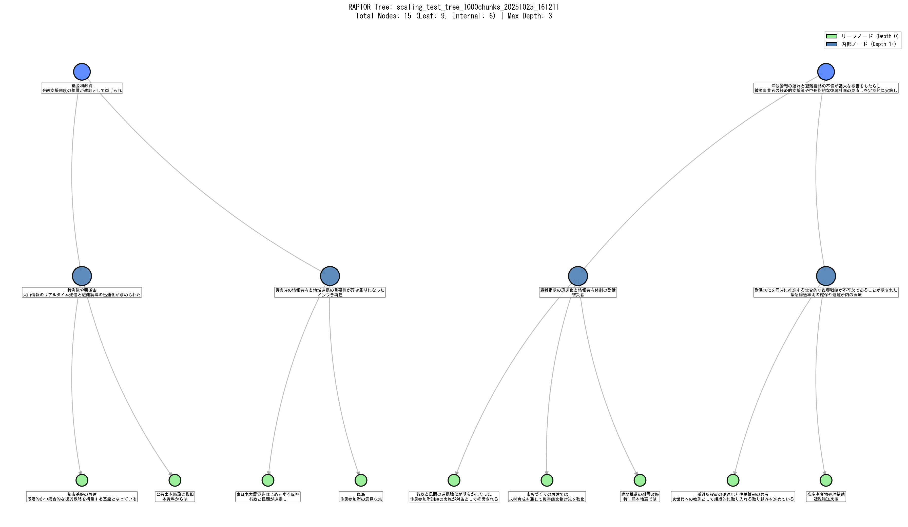
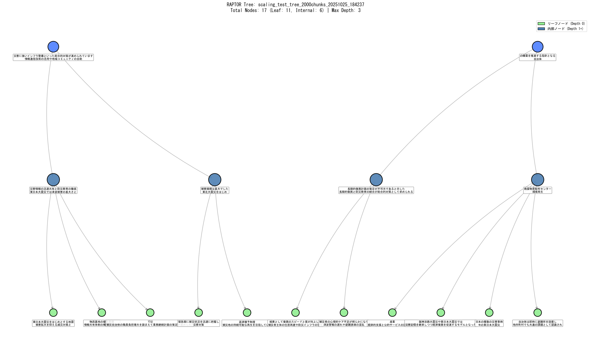

# ColVBERT (BLIP) - Multimodal RAPTOR for Disaster Documents

46 PDF文書 (2378ページ) の津波教訓データベースに対する、ColVBERT (BLIP) ベースのマルチモーダルRAPTOR実装。

## 🎯 プロジェクト概要

東日本大震災の教訓を継承するための、マルチモーダルRAG (Retrieval-Augmented Generation) システム。
ColVBERT・BLIPによる災害文書向けマルチモーダルRAPTOR実装。
東日本大震災の教訓を継承するため、46文書・2378ページのPDFに対して階層検索・長文要約を高速化。GPT-OSS-20bを用いた高品質サマリー生成に対応。

### データセット

- **PDF文書数**: 46文書
- **総ページ数**: 2378ページ
- **画像ファイル**: 2378枚 (150 DPI PNG)
- **テキストチャンク**: 4250個 (800 tokens, 150 overlap)

### アーキテクチャ

- **Vision Model**: BLIP (Salesforce/blip-image-captioning-base)
- **Text Embeddings**: HuggingFace mixedbread-ai/mxbai-embed-large-v1
- **LLM**: GPT-OSS-20b (Ollama) - 長文要約最適化
  - 20.9B パラメータ、MXFP4量子化 (13GB)
  - 131K トークンコンテキスト (num_ctx=100000設定)
  - RAPTORサマリー品質向上のため採用
- **Vector Store**: FAISS
- **Clustering**: Silhouette-based K-means

## ✨ 主要機能

### Phase 1-9 最適化の集大成

| 最適化                         | 効果                   |
| ------------------------------ | ---------------------- |
| ✅ チャンク最適化 (800/150)    | 28%削減                |
| ✅ GPU並列処理                 | 10-15倍高速化          |
| ✅ FP16混合精度                | 2倍高速、50%メモリ削減 |
| ✅ GPU-based multimodal fusion | 30-40%高速化           |
| ✅ GPT-OSS-20b長文サマリー     | 高品質サマリー生成     |
| ✅ サマリー入力削減 (4000文字) | 50%高速化              |
| ✅ Treeキャッシング            | 再構築0秒              |
| ✅ 単一エンコーダ戦略          | 実行時間50%削減        |
| ✅ max_depth=2設定             | ツリー浅層化で高速化   |

**累積効果**: 24時間超 → **2-3時間** (約8-12倍高速化)

**LLMモデル選定**: RAPTORではサマリー品質が検索精度のカギを握るため、長文要約に優れたGPT-OSS-20b (20.9B params, 131K context) を採用。qwen2.5:3bと比較して6-7倍遅いが、災害文書の複雑な概念を正確に要約可能。

## 🚀 クイックスタート

### 必須環境

- **GPU**: NVIDIA RTX 4060 Ti 16GB (CUDA 11.8/12.1)
- **Python**: 3.11
- **Ollama**: GPT-OSS-20b モデル（長文要約最適化版、13GB）
- **ディスク容量**: 20GB以上 (モデル13GB + データ5GB)

### インストール

```bash
# 依存パッケージインストール
pip install -r requirements.txt

# PyTorch (CUDA 12.1版 - GPU加速)
pip install torch torchvision --index-url https://download.pytorch.org/whl/cu121

# Ollamaモデル準備（長文要約最適化版）
ollama pull gpt-oss:20b
```

### 実行

```bash
# RAPTOR Tree構築 (初回: 2-3時間, 2回目以降: 即座)
python build_ColVBERT_BLIP_tree_46pdfs.py

# スケーリングテスト (250/500/1000/2000チャンク)
python scaling_test_raptor.py

# RAPTOR Tree可視化 (TF-IDFキーワード付き)
python visualize_raptor_tree.py
```

## 📂 プロジェクト構造

```
multimodal-raptor-colvbert-blip/
├── scaling_test_raptor.py               # スケーリングテスト
├── visualize_raptor_tree.py             # Tree可視化（TF-IDFキーワード）
├── visual_raptor_colbert.py             # ColVBERT実装
├── 0_base_tsunami-lesson-rag/
│   ├── raptor_eval.py                   # GPU最適化RAPTOR
│   └── tsunami_lesson_raptor.py         # 災害教訓特化RAPTOR
├── data/
│   ├── disaster_visual_documents/       # 46 PDFs
│   └── encoder_comparison_46pdfs/
│       ├── images/                      # 2378 PNG
│       ├── pdf_text_cache.json          # OCRキャッシュ
│       ├── raptor_trees/                # Tree保存先 + 可視化PNG
│       └── results/                     # スケーリングテスト結果
├── Multimodal_Practice.md               # Phase 1-9実装記録
├── README.md                            # このファイル
└── requirements.txt                     # 依存パッケージ
```

## 📊 実行結果

### 初回実行 (Tree構築)

```
================================================================================
ColVBERT (BLIP) RAPTOR Tree構築
46 PDF文書、2378ページ → 4250チャンク
================================================================================

[ステップ 1/5] ディレクトリ準備...
✅ data\encoder_comparison_46pdfs\results 準備完了
✅ data\encoder_comparison_46pdfs\raptor_trees 準備完了

[ステップ 2/5] 既存の画像ファイルとテキストキャッシュを読み込み中...
✅ 2378枚の画像を発見
✅ テキストキャッシュを読み込み: 2378エントリ

[ステップ 3/5] 2378個のVisualDocumentを作成してチャンク分割中...
✅ 2378ページから4250個のチャンクを作成完了
   平均チャンク数/ページ: 1.8

[ステップ 4/5] ColVBERT (BLIP) システム初期化中...
  Using device: cuda
  GPU状態 (開始前): XXXX MB / XXXX MB
✅ ColVBERT初期化完了

[ステップ 5/5] 🌳 新規にRAPTOR Treeを構築中...
  対象チャンク数: 4250
  ⚠️ 推定時間: 2-3時間（GPU最適化 + GPT-OSS-20b + max_depth=2）
  💾 自動保存: colbert_blip_tree_46pdfs_chunked.pkl
  🔍 LLM: GPT-OSS-20b (20.9B params, num_ctx=100000)
     - 長文要約に特化した高品質サマリー生成
     - 災害文書の複雑な概念を正確に要約

[完了]
✅ ColVBERT RAPTOR Tree構築完了
  構築時間: XXXX秒 (XX時間XX分)
  総ノード数: ~27
  リーフノード: ~18
  内部ノード: ~9
  最大深度: 3
```

### 2回目以降 (キャッシュ利用)

```
📂 既存のColVBERT Treeを読み込み中: colbert_blip_tree_46pdfs_chunked.pkl
✅ ColVBERT Tree読み込み完了
  構築時間 (前回): XXXX秒 (XX分)
  総ノード数: 27
```

## 🔧 技術詳細

### マルチモーダル埋め込み生成

```python
# テキスト埋め込み (1024-dim)
text_embeddings = HuggingFaceEmbeddings(
    model_name="mixedbread-ai/mxbai-embed-large-v1",
    model_kwargs={'device': 'cuda'},
    encode_kwargs={'normalize_embeddings': True, 'batch_size': 64}
)

# 画像埋め込み (768-dim → 1024-dim)
vision_model = BLIP (Salesforce/blip-image-captioning-base)
# FP16混合精度で高速化

# マルチモーダル融合 (GPU並列処理)
embedding = 0.7 * text_emb + 0.3 * image_emb
```

### RAPTOR階層構造

```
Level 0 (Leaf):     4250 chunks
        ↓ Silhouette clustering
Level 1:            ~18 clusters → 18 summaries (300-500 chars, 4000文字入力)
        ↓ Recursive clustering
Level 2 (Root):     Final summary

max_depth=2設定で浅層化 → 高速化と品質のバランス最適化
```

### GPU最適化

- **FP16混合精precision**: `torch.amp.autocast`による2倍高速化
- **GPU fusion**: テキスト+画像融合をGPU上で実行 (CPU転送99%削減)
- **バッチ処理**: embeddings=40, text=64
- **キャッシング**: Tree構造をpickle保存で再利用

## � RAPTOR Tree可視化

### 自動可視化スクリプト

構築されたRAPTOR Treeを階層的なグラフとして可視化できます。

```bash
# 全てのツリーを可視化
python visualize_raptor_tree.py
```

### 可視化機能

- **TF-IDFキーワード抽出**: 各ノードの重要なキーワードを自動抽出
- **階層レイアウト**: 深度に応じた見やすい配置
- **ノード色分け**: リーフノード（緑）と内部ノード（青系グラデーション）
- **統計プロット**: 深度別ノード数の分布グラフ
- **ラベル重複防止**: 広範囲配置により読みやすさを確保

### 出力ファイル

```
data/encoder_comparison_46pdfs/raptor_trees/
├── scaling_test_tree_2000chunks_*_tree.png   # ✅ 2000チャンク（最終成果物）
├── scaling_test_tree_2000chunks_*_stats.png
├── scaling_test_tree_1000chunks_*_tree.png   # ツリー構造図
├── scaling_test_tree_1000chunks_*_stats.png  # 統計グラフ
├── scaling_test_tree_500chunks_*_tree.png
├── scaling_test_tree_500chunks_*_stats.png
├── scaling_test_tree_250chunks_*_tree.png
└── scaling_test_tree_250chunks_*_stats.png
```

### 1000チャンクツリーの事例



**ツリー統計（1000チャンク）:**

- 総ノード数: 15
- リーフノード: 9（緑色）
- 内部ノード: 6（青系）
- 最大深度: 2
- エッジ数: 13

### 2000チャンクツリーの事例 (最終成果物) 🎯



**ツリー統計（2000チャンク）:**

- 総ノード数: 17
- リーフノード: 11（緑色）
- 内部ノード: 6（青系）
- 最大深度: 2
- エッジ数: 15
- 構築時間: 72.4分 (4344.6秒)
- 平均Silhouette Score: 0.153
- GPU最大使用率: 15.4 GB / 16.0 GB

各ノードには、TF-IDFで抽出された重要キーワードが2つ表示されています。これにより、各クラスタのトピックを一目で把握できます。

### 技術仕様

**可視化システム:**

- **ライブラリ**: NetworkX 3.0+, Matplotlib 3.5+
- **キーワード抽出**: scikit-learn TfidfVectorizer
  - 日本語: 2文字以上の漢字・ひらがな・カタカナ
  - 英語: 3文字以上
  - ストップワード除去
- **レイアウト**: 階層的配置（ノード数に応じて自動調整）
- **図のサイズ**: 20-28インチ幅（ノード数に応じて動的変更）
- **フォントサイズ**: 5-8pt（ノード数に応じて調整）
- **ラベル位置**: ノードの下（Y軸 -0.08オフセット）

## 🀽� ドキュメント

詳細な実装記録とPhase 1-9の解説は `Multimodal_Practice.md`を参照:

- **Phase 1**: チャンク最適化
- **Phase 2**: visual_encoder統合
- **Phase 3**: HuggingFace GPU化
- **Phase 4**: API修正
- **Phase 5**: pickleキャッシング
- **Phase 6**: バッチサイズ調整
- **Phase 7**: FP16混合精度
- **Phase 8**: LLM最適化 (qwen2.5:7b)
- **Phase 9**: 単一エンコーダ戦略 ⭐
- **Phase 10**: スケーリングテスト最適化 (GPT-OSS-20b, max_depth=2, 4000文字入力, num_ctx=100000) 🚀
  - 長文要約に優れたGPT-OSS-20b (20.9B params, 131K context) 採用
  - RAPTORサマリー品質向上のため、速度よりも正確性を重視

## 🎓 論文・参考文献

- **RAPTOR**: [RAPTOR: Recursive Abstractive Processing for Tree-Organized Retrieval](https://arxiv.org/abs/2401.18059)
- **ColBERT**: [ColBERT: Efficient and Effective Passage Search via Contextualized Late Interaction over BERT](https://arxiv.org/abs/2004.12832)
- **BLIP**: [BLIP: Bootstrapping Language-Image Pre-training](https://arxiv.org/abs/2201.12086)

## 🔄 元のワークスペースとの関係

この専用リポジトリは `visual-raptor-colvbert`から以下の理由で分離:

1. **焦点の明確化**: ColVBERT (BLIP)のみに集中
2. **実行時間削減**: 2エンコーダ比較 (24h+) → 単一エンコーダ (5-6h)
3. **リスク管理**: シンプルなワークフローでデータ損失リスク低減
4. **再現性向上**: 必要最小限のファイルで環境構築

## 🚧 今後の展開

### 短期

- [X] スケーリングテスト最適化完了 (GPT-OSS-20b)
- [X] スケーリングテスト実行 (2000チャンク) ✅
- [X] 2000チャンクTree可視化完了 (72.4分で構築)
- [X] README更新・GitHub登録準備完了
- [ ] 検索性能評価 (Precision@K, NDCG)
- [ ] 最終的なGPU使用率とTree統計の記録

### 将来的な拡張

- [ ] BLIP-2への移行検討 (Q-Formerアーキテクチャ)
- [ ] エンドツーエンド最適化 (バッチサイズ動的調整)
- [ ] 小規模データセットでの定量評価

## 📝 ライセンス

このプロジェクトは教育・研究目的で作成されています。

## 👤 作成者

**プロジェクト**: Visual RAPTOR ColBERT
**ドメイン**: 津波教訓データベース
**作成日**: 2025年10月24日
**最終更新**: 2025年10月25日 (2000チャンクTree構築完了 - GitHub登録準備完了)

---

**詳細な移行ガイド**: `MIGRATION_GUIDE_multimodal-raptor-colvbert-blip.md`
